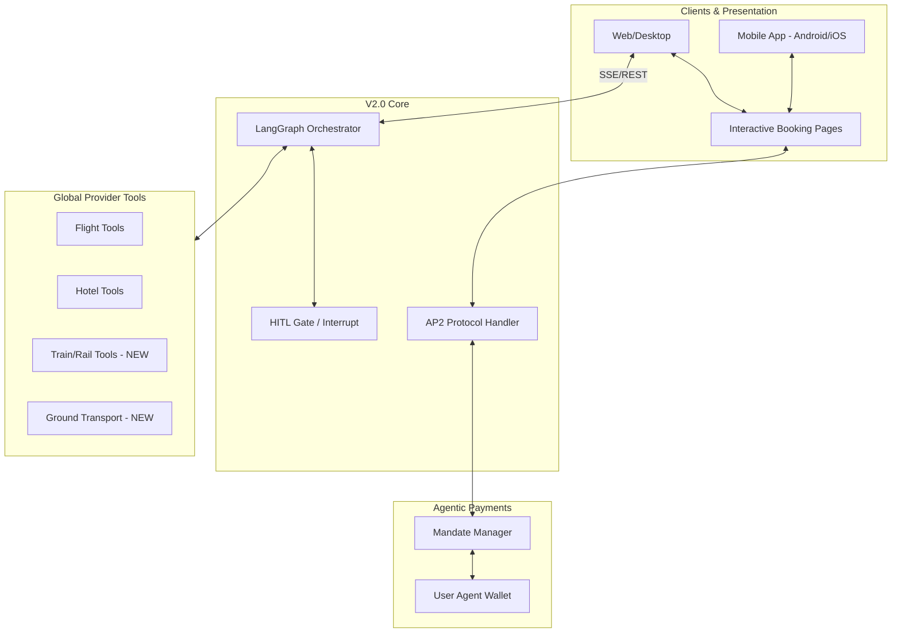

# Agentic Planner v2.0 — Agentic Commerce & Autonomous Execution

> **Target**: 10,000+ users · AP2 Payment Protocol · Rail/Global Transport · Human-in-the-Loop (HITL) · Dynamic Booking Pages

---

## Implementation Priority Order (V2.0)

| Priority | Module | Effort | Impact | Status |
|---|---|---|---|---|
| 🔴 P0 | **Rail Integration (Trains)** | 12h | Essential for EU/Global markets | [ ] Planning |
| 🔴 P0 | **AP2 Protocol (Agent Payments)** | 15h | Enables autonomous checkout | [ ] Research |
| 🟠 P1 | **React Native Mobile App** | 25h | Android & iOS native presence | [ ] Planning |
| 🟠 P1 | **Booking Pages (Interactive UI)** | 8h | Completes the booking loop | [ design |
| 🟠 P1 | **LangGraph HITL (Interrupts)** | 6h | Safety gate for transactions | [ ] Implementation |
| 🟡 P2 | **Multi-Modal Reasoning** | 10h | Support for images (vouchers/IDs) | [ ] Exploratory |
| 🟡 P2 | **Push Notifications & Voice** | 12h | Real-time agent alerts | [ ] Design |
| 🟡 P2 | **Agent-to-Agent (A2A) Discovery**| 12h | Negotiate with Merchant Agents | [ ] Future |

---

## System Overview — Evolution to Agentic Commerce



---

## 1. Transport Ecosystem Expansion

### 1.1 Rail & Ground Transport Integration
Travel isn't just flights. V2.0 introduces deep integration for global rail networks.

**Proposed Tool: `search_trains`**
- **Providers**: SilverRail, Trainline API, or Amadeus Rail.
- **Scope**: Multi-country rail itineraries (Eurostar, Amtrak, JR Pass).

```python
# agent_file/tools/transport/rail_tools.py
@tool
def search_trains(
    departure_city: str,
    arrival_city: str,
    travel_date: str,
    pref_class: str = "economy"
) -> str:
    """
    Search for train routes, schedules and pricing.
    Supports high-speed and regional rail.
    """
    # Implementation connecting to Rail Provider API
    pass
```

### 1.2 Ground Transportation (Ride-Share & Rentals)
- **Tool**: `search_car_rentals` (Hertz, Avis).
- **Tool**: `estimate_rideshare` (Uber/Lyft API integration for airport transfers).

---

## 2. AP2 (Agent Payments Protocol) Implementation

AP2 is the "Trust Layer" for agentic commerce. V2.0 will implement the **Mandate-based** payment system.

### 2.1 Mandate Architecture
Agents do not have direct access to credit cards. They operate via signed **Mandates**.

1.  **Intent Mandate**: "I authorize you to spend up to $500 if you find a flight under 4 hours."
2.  **Cart Mandate**: "I approve this specific itinerary (Flight X + Hotel Y) for $1,250. Execute now."

### 2.2 AP2 Schema — `llmops/ap2_handler.py`

```python
"""
AP2 Mandate Handler for autonomous booking.
Includes cryptographic signing and budget verification.
"""
from pydantic import BaseModel
from typing import List, Optional

class PaymentMandate(BaseModel):
    mandate_id: str
    user_id: str
    max_amount: float
    currency: str = "USD"
    constraints: dict  # e.g., {"priority": "direct_flights_only"}
    expires_at: int
    signature: str     # Cryptographic proof of user intent

class AgentCart(BaseModel):
    items: List[dict]
    total_price: float
    mandate_id: str

def verify_and_execute_ap2(cart: AgentCart):
    # 1. Verify Mandate signature
    # 2. Check if total_price <= mandate.max_amount
    # 3. Call Merchant Agent / Payment Provider
    pass
```

---

## 3. Interactive Booking Pages

Moving beyond text-only chats to **Rich Presentation Layers**.

### 3.1 The "Booking Page" Workflow
When an agent finds a valid plan, instead of just describing it, it generates a **Shared Booking State**.

1.  **Agent**: "I've found a great deal. View the summary here: `[Interactive Link]`"
2.  **UI**: Renders a rich React/HTML component (the Booking Page) with the "Cart Mandate".
3.  **Human**: Reviews the visual itinerary, clicks "Confirm Payment".
4.  **Agent**: Receives the signed mandate and executes the AP2 transaction.

### 3.2 Dynamic UI Component Structure
```json
{
  "component": "BookingCart",
  "data": {
    "itinerary_id": "TRIP-9921",
    "flights": [{"carrier": "UA", "price": 450}],
    "hotel": {"name": "Hilton Paris", "price": 800},
    "total": 1250,
    "ap2_mandate_required": true
  }
}
```

---

## 4. Advanced Human-in-the-Loop (HITL)

V2.0 uses LangGraph **Interrupts** to ensure critical decisions are human-verified.

### 4.1 Checkpoint & Interrupt Strategy
Instead of the agent guessing when to stop, we define "Hard Breakpoints" in the graph.

```python
# In GraphBuilder (LangGraph)
workflow.add_node("agent", call_model)
workflow.add_node("action", call_tool)

# Interrupt before payment
workflow.compile(
    checkpointer=memory,
    interrupt_before=["execute_payment"] 
)
```

### 4.2 `ASK_USER` Tool
A specialized tool for clarification mid-execution.
- **usage**: "I found two flights at similar prices, one is early morning, one is late night. Which do you prefer?"

---

## 5. Cross-Platform Mobile Application (Android/iOS)

V2.0 transitions from a web-only experience to a full-featured mobile presence using **React Native / Expo**.

### 5.1 Mobile-Native Capabilities
- **Push Notifications**: Real-time alerts for flight delays, train platform changes, or "Action Required" interrupts (HITL).
- **Proximity Alerts**: Location-aware agent signals (e.g., "You've landed in London. Should I book an Uber to your hotel?").
- **Offline Mode**: View itineraries and booking vouchers (AP2 receipts) without an active internet connection.

### 5.2 Voice Integration (Talk-to-Plan)
- Using **Whisper (Local/Cloud)** for high-fidelity voice-to-text.
- Users can plan trips while driving or on the move: *"Hey Planner, add a dinner reservation at a vegan place near my hotel for tonight."*

### 5.3 Biometric Payment Authorization
- Integration of **FaceID / Fingerprint** as the "Mandate Signing" mechanism for the AP2 protocol.
- Significantly lowers friction for autonomous commerce approval.

---

## 6. Intelligence & Observability Upgrades

### 5.1 Multi-Modal Context
- Agents can now "see" documents.
- **Use Case**: Upload a screenshot of a previous booking confirmation to help the agent find matching return flights or cancellations.

### 5.2 Agent Graph Visualizer
Integrate **LangSmith/LangGraph SDK** into the admin dashboard to see real-time "Thought Maps" of the agent.

### 5.3 Personalized Knowledge Retrieval (VDB Fine-Tuning)
- **Dynamic Context**: Injecting "Home Airport", "Frequent Flyer Numbers", and "Dietary Restrictions" automatically from the `user_profile_memory` created in V1.0.

---

## V2.0 Roadmap Timeline
- **Phase 1 (Month 1)**: Rail Integration & `ASK_USER` tool.
- **Phase 2 (Month 2)**: AP2 Protocol Research & Mock implementation.
- **Phase 3 (Month 3)**: Booking Pages Frontend & LangGraph Interrupts.
- **Phase 4 (Month 4)**: Full Beta with Autonomous Checkout.
