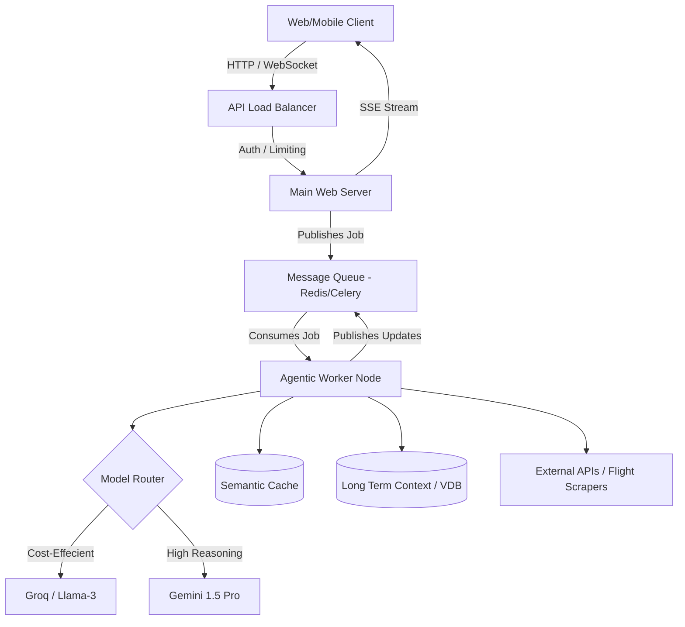

# Agentic Planner v1.0 - LLMOps & System Architecture Planning

This document outlines the architecture, implementation phases, and strategic enhancements for building a highly scalable, professional-grade backend and agentic system for **Agentic Planner v1.0**.

---

## 1. Implementation Priority Roadmap

To quickly reach a stable v1.0, the implementation follows a structured priority, focusing first on core safety and basic functionality before scaling outwards.

### Phase 1: Core Reliability & Guardrails (High Priority)
*These form the foundation of your agentic system. Do these before scaling.*
1. **Agent Loop Protection & Fallback Logic:** 
   - Implement hard caps on agent loops (e.g., `max_iterations = 5`) to prevent infinite reasoning loops and skyrocketing API costs.
   - Solidify the dual-LLM architecture: Default to faster/cheaper models (e.g., Groq) and seamlessly fail over to heavy-duty models (e.g., Gemini Pro) upon API rate limits or failures.
2. **Schema Validation & Error Handling:** 
   - Ensure all data passed to and from the LLM (like `SystemMessage` arrays and tool calls) uses strict Pydantic parsing. 
   - Implement graceful error recovery so UI clients never see raw traceback errors.
3. **Structured Telemetry & Logging:**
   - Standardize logs in JSON format detailing the agent's actions, tool execution time, and token usage per step.

### Phase 2: Orchestration & Memory Layer (Medium Priority)
1. **Multi-Model Routing Layer:** 
   - Establish a gateway to dynamically route simple user intents to lighter LLMs, reserving flagship models solely for complex travel routing or multi-objective planning.
2. **Context Window Optimization:** 
   - Handle context injection carefully. Implement ring-buffers or dynamic summarization to prevent older interactions from saturating the context window and diluting instructions.
3. **Caching Layer:** 
   - Implement standard in-memory or Redis caching for identical API requests (e.g., fetching same city metadata) to reduce LLM and external API costs.

### Phase 3: Scalability & Asynchronous Processing (Medium-High Priority)
1. **Background Tasks & Queueing:**
   - Move intensive agent-loop processes out of the HTTP request cycle. Use a task queue (like Celery/RabbitMQ) and worker nodes. Keep the API server lightweight.
2. **Real-time Event Streaming:**
   - Implement Server-Sent Events (SSE) or WebSockets to stream granular agent updates (e.g., "Researching Paris...", "Finding flights...") back to the frontend in real-time.
3. **Comprehensive Observability:**
   - Integrate LangSmith, Datadog, or similar tools for end-to-end tracing of the agent's reasoning.

### Phase 4: Production Resilience (Long Term)
1. **Horizontal Scaling:** Ensure all agentic workers and API servers are stateless and containerized for deployment under load balancers.
2. **Database Integration:** Connect standard RDBMS for user profile management and a Vector Database for long-term memory retrieval.

---

## 2. Component Deep-Dive

### A. Multi-Model Routing & Gateway
- **Pattern:** Application-Level Router (or tools like LiteLLM).
- **Execution:** When a prompt is requested, classify its complexity. Standard queries use fast/low-cost LLMs; advanced planning tasks route to the primary high-reasoning LLM.

### B. Agent Tool Execution Sandbox
- **Pattern:** Circuit Breakers.
- **Execution:** If an agent attempts to execute a tool with hallucinated parameters, catch the exception via Pydantic. Feed the error back to the LLM (max 2 retries). If it fails again, invoke a safe human-in-the-loop fallback.

### C. Background Task Architecture
- **Pattern:** Pub/Sub (Publisher-Subscriber).
- **Execution:** When the frontend requests a trip, the backend returns an immediate `uuid` job ID. A background worker picks up the job, runs the LLM loops, and publishes status messages to a queue. The frontend listens to updates using that job ID.

### D. Memory Management
- **Short-Term (Working Memory):** Limited memory localized to the current active session/trip planning phase.
- **Long-Term (Episodic Memory):** Storing preferred airlines, past trips, and user constraints in a scalable database or Vector DB to personalize future results.

---

## 3. Strategic System Architecture (Visualized)

---

## 4. Suggestions to Make the Agent System "Next-Level"

To push your platform from a standard AI wrapper to a professional, enterprise-grade agentic system, consider these features:

1. **Semantic Caching:**
   Instead of caching exact string matches, introduce a semantic cache (e.g., RedisVL or GPTCache). If User A asks for "Trip to Tokyo in June" and User B asks for "June vacation in Tokyo", the system automatically serves the cached plan, greatly reducing response times and cost.
   
2. **Shadow Deployments For Prompts:**
   When you change core agent instructions, deploy them in "shadow mode." Run the new prompts asynchronously on live traffic but continue serving the old version to the user. Compare the outputs programmatically to ensure you haven't degraded reasoning capabilities before pushing the new prompts live broadly.
   
3. **Structured "Thinking" Output:**
   Have the LLM produce a strictly typed JSON output containing a `"thinking"` or `"scratchpad"` section that is hidden from the user, alongside the `"action"` to take. This massively improves the reliability of agent tool usage compared to raw text generation.

4. **Self-Reflection & Human-In-The-Loop:**
   Empower the agent to generate an internal "confidence scale". If the model requests a flight but context is fuzzy, it should halt execution and proactively prompt the user (`ASK_USER` tool) rather than risking an incorrect, unrecoverable action.

5. **Automated LLM-as-a-Judge Evaluation Pipeline:**
   Construct a CI test suite with 100 benchmark user travel queries. On every pull request, have a separate evaluator LLM grade the agent's output for logical formatting, tool accuracy, and latency, preventing bad system prompts from entering production.
